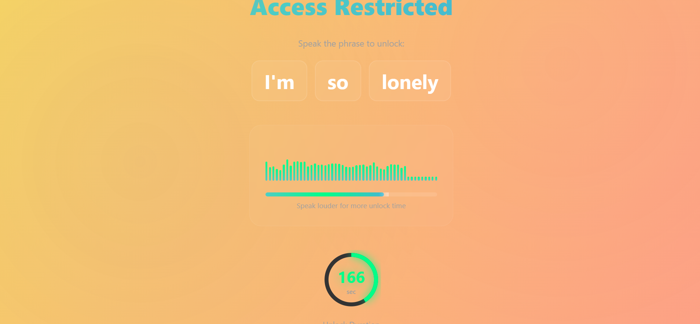

# Scream Detection Lock 

A Chrome extension that **blocks social media sites** (Facebook, Instagram, Twitter) until you **scream "I'm so lonely"** into your microphone. The louder you scream, the more time you get to browse.

Simply, A productivity tool that blocks websites and makes you say embarrassing things to unlock them.

## What it does
This extension blocks websites and shows a lock screen. To unlock it, you have to say "I'm so lonely" into your microphone. The louder you speak, the longer you get unlocked for.

Yeah, it's weird.

## Features

- Blocks websites with a fancy lock screen
- Voice recognition to detect the unlock phrase
- Volume-based unlock timer - speak louder for more time
- Real-time audio visualizer with waves and volume bars
- Feedback based on how loud you were
